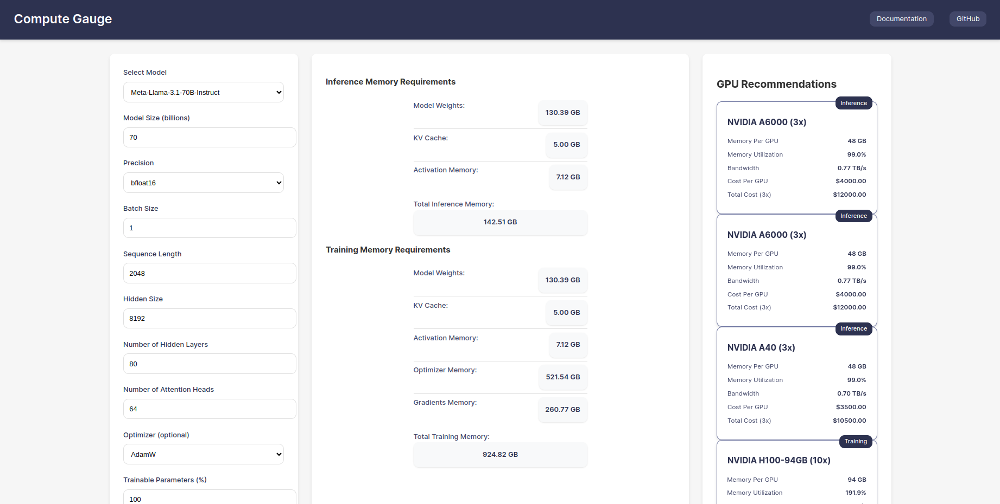

<div align="center">

# Compute Gauge 


An advanced memory calculator for LLMs, helping researchers and practitioners estimate memory requirements for both training and inference.




</div>

## Overview 

Compute Gauge is a powerful web-based tool that provides accurate memory calculations for machine learning models. It helps you:

- Calculate memory requirements for model weights
- Estimate KV cache memory usage
- Determine activation memory needs
- Plan training memory requirements
- Support various model architectures
- Recommend GPU configurations

## Features 

- **Comprehensive Memory Calculation**
  - Model weights memory
  - Key-Value cache memory
  - Activation memory
  - Optimizer states memory
  - Gradient memory

- **Multiple Precision Support**
  - float32
  - float16
  - bfloat16
  - int8
  - int4

- **Training Optimizers**
  - AdamW
  - Quantized AdamW
  - SGD

- **Pre-configured Models**
  - LLama
  - Mixtral
  - Qwen
  - Nvidia Nemotron

## Getting Started 

### Prerequisites

- Go 1.21 or later

### Installation

1. Clone the repository
```bash
git clone https://github.com/NathanaelTamirat/ComputeGauge.git
cd ComputeGauge
```

2. Install dependencies
```bash
go mod download
```

3. Run the application
```bash
go run main.go
```

4. Open your browser and navigate to:
```
http://localhost:8080
```

## Usage 

1. Select a predefined model or enter custom parameters
2. Adjust batch size, sequence length, and other parameters
3. Choose precision and optimizer (for training)
4. Click "Calculate" to see detailed memory breakdowns

## API Reference 

### Calculate Memory Requirements

**Endpoint:** `POST /api/calculate`

**Request Body:**
```json
{
    "model_size": 7,
    "precision": "float16",
    "batch_size": 1,
    "sequence_length": 2048,
    "hidden_size": 4096,
    "num_hidden_layers": 32,
    "num_attention_heads": 32,
    "optimizer": "AdamW",
    "trainable_params": 100
}
```

**Response:**
```json
{
    "model_weights": "14.00 GB",
    "kv_cache": "1.07 GB",
    "activation_memory": "2.34 GB",
    "optimizer_memory": "56.00 GB",
    "gradients_memory": "28.00 GB",
    "total_memory": "101.41 GB"
}
```

## Directory Structure 

```
compute-gauge/
├── api/
│   └── v1/
│       └── handler.go           # Vercel serverless entry point
├── cmd/
│   └── compute-gauge/
│       └── main.go             # Local development entry point
├── internal/                   # Private application code
│   ├── app/
│   │   └── server.go
│   ├── config/
│   │   └── models.go
│   ├── handlers/
│   └── models/                 # Model JSON definitions
├── pkg/                       # Public, reusable packages
│   ├── calc/
│   │   └── utils.go
│   ├── gpu/
│   │   └── recommendations.go
│   └── memory/
│       ├── calculator.go
│       └── types.go
├── web/
│   ├── static/
│   └── templates/
└── vercel.json     
```


## License 

MIT License

Copyright (c) 2024 Nathanael 

Permission is hereby granted, free of charge, to any person obtaining a copy
of this software and associated documentation files (the "Software"), to deal
in the Software without restriction, including without limitation the rights
to use, copy, modify, merge, publish, distribute, sublicense, and/or sell
copies of the Software, and to permit persons to whom the Software is
furnished to do so, subject to the following conditions:

The above copyright notice and this permission notice shall be included in all
copies or substantial portions of the Software.

THE SOFTWARE IS PROVIDED "AS IS", WITHOUT WARRANTY OF ANY KIND, EXPRESS OR
IMPLIED, INCLUDING BUT NOT LIMITED TO THE WARRANTIES OF MERCHANTABILITY,
FITNESS FOR A PARTICULAR PURPOSE AND NONINFRINGEMENT. IN NO EVENT SHALL THE
AUTHORS OR COPYRIGHT HOLDERS BE LIABLE FOR ANY CLAIM, DAMAGES OR OTHER
LIABILITY, WHETHER IN AN ACTION OF CONTRACT, TORT OR OTHERWISE, ARISING FROM,
OUT OF OR IN CONNECTION WITH THE SOFTWARE OR THE USE OR OTHER DEALINGS IN THE
SOFTWARE. 


## References 

[1] https://huggingface.co/docs/transformers/model_memory_anatomy

[2] https://huggingface.co/docs/transformers/perf_train_gpu_one

[3] https://developer.nvidia.com/blog/mastering-llm-techniques-inference-optimization/

[4] https://medium.com/@manuelescobar-dev/memory-requirements-for-llm-training-and-inference-97e4ab08091b

[5] https://awsdocs-neuron.readthedocs-hosted.com/en/latest/libraries/neuronx-distributed/activation_memory_reduction.html

[6] https://www.oreilly.com/library/view/generative-ai-on/9781098159214/ch04.html